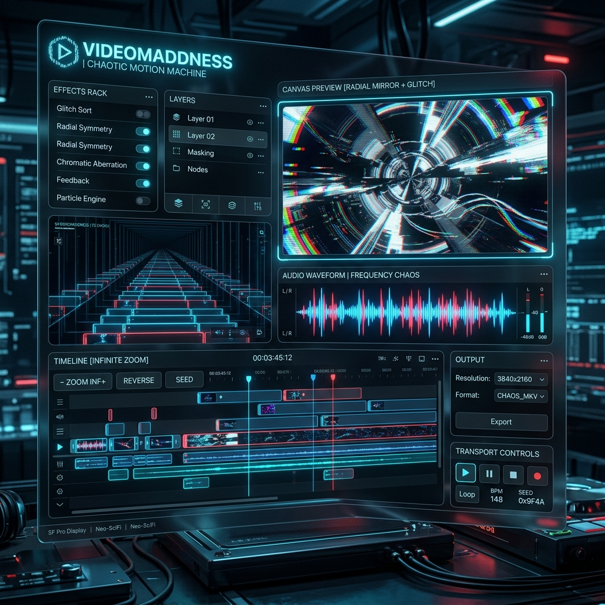

# Videomaddness // Chaotic Motion Machine



A standalone browser-based web application designed to transform static images into infinite-diving, depth-sliced video loops. Perfect for generating hypnotic, symmetrical backgrounds and glitches for social media layouts.

I asked AGY to create this as I needed something like this to my underground metal band. I don't have time to do all these in Davinci Resolve and...well in the end this was fun and for learning.

---

## Features
- **Adaptive Luminosity Slicing**: Automatically splits images into distinct, detail-balanced depth bands using pixel-count histograms.
- **Layer Edge Fade (Vignette)**: Adjustable blending slider (0% to 50%) to smoothly fade out layer borders and blend different images seamlessly.
- **Layer Inspector Preview**: Live visual card with custom backgrounds (Checkerboard, Black, White, Magenta) to examine isolated mask details.
- **Infinite Diving Engine**: Exponential zoom camera tunnel ($S(z) = d^{(z - 0.5) \cdot 2.0}$) creating true depth perspective.
- **Aspect Ratio Selector**: Instantly crop and scale frames for social media ratios (**9:16 Portrait**, **1:1 Square**, **4:5 Feed**, **16:9 Landscape**, **21:9 Cinema**).
- **Cybernetic Glitch FX**: Post-process RGB channel splitting, horizontal pixel-sorting, and screen shaking (switched off by default).
- **Exporting Engine**: Client-side H.264/MP4 video generation via the browser's WebCodecs API and `mp4-muxer.js` (including offline timeline rendering and encoding of audio soundtracks), ensuring high compatibility with Instagram, TikTok, and media players. Automatically falls back to WebM (MediaRecorder) on browsers where WebCodecs H.264 encoding is unsupported.

---

## Local Usage

Because this application uses modular ES6 Javascript, modern browsers block loading scripts directly from the filesystem (`file:///` URLs) due to security/CORS restrictions. An HTTP server is required.

We have included automated launchers to start a lightweight server with zero configuration:

### Running on Windows:
1. Double-click **`run.bat`**.
2. The launcher will search for **Python** or **Node.js** to start a server.
3. If neither is installed, it will automatically offer to install Python 3 via Windows Package Manager (`winget`). Accept the Windows UAC prompts, let it install, close the window, and click `run.bat` again.
4. The server will launch and automatically open your default browser to **`http://localhost:8000`**.

### Running on macOS or Linux:
1. Open a terminal in this directory.
2. Make the launcher executable: `chmod +x run.sh`
3. Run the launcher: `./run.sh`
4. The app will serve at **`http://localhost:8000`**.

---

## Docker Stack Deployment (Portainer.io)

This project is packaged with a lightweight `Dockerfile` and a `docker-compose.yml` stack definition, allowing it to be served via an Nginx container inside Portainer.

### Method 1: Deploy as a Portainer Stack (Recommended)
1. Push this folder to your personal **GitHub** repository.
2. Log into your **Portainer.io** panel.
3. Go to **Stacks** > **Add stack**.
4. Set a name (e.g., `videomaddness`).
5. Choose **Build method** > **Repository**.
6. Enter your GitHub Repository URL (e.g. `https://github.com/yourusername/videomaddness`).
7. Leave **Repository reference** as `refs/heads/main` (or your active branch).
8. Ensure **Compose path** is set to `docker-compose.yml`.
9. Click **Deploy the stack**. Portainer will pull the code, build the Nginx container, and launch the service.
10. Open `http://<your-server-ip>:8080` in your web browser to use the app!

### Method 2: Deploy Locally via CLI
If you want to run the Docker stack on your host computer:
```bash
# Build and run the stack in the background
docker-compose up -d --build
```
The application will be available at `http://localhost:8080`.

---

## Repository Contents
- `index.html` - Application layout and user controls.
- `style.css` - Neomorphic cyan/purple glassmorphic stylesheet.
- `js/` - Directory containing the modular ES6 Javascript engine:
  - `state.js` - Central application state manager.
  - `ui.js` - DOM element selection mapping.
  - `utils.js` - General helper functions (fonts, math, color convert).
  - `masking.js` - ImageProcessor (layer extraction, edge vignette, histogram quantiles).
  - `glitch.js` - GlitchManager (pixel sorting, shakes, splits).
  - `audio.js` - Audio synchronization and timeline playback nodes.
  - `overlays.js` - Text and Graphic canvas overlays drawers.
  - `timeline.js` - Timeline tracks renderer and mouse drag/resize handlers.
  - `exporter.js` - VideoExporter WebM recorder.
  - `app.js` - Main entry module, binding sidebars and event listeners.
- `fonts/` - Directory for pre-loading custom fonts (configured in `fonts/fonts.json`).
- `run.bat` - One-click Windows server launcher (with winget installer check).
- `run.sh` - One-click macOS/Linux server launcher.
- `Dockerfile` - Alpine-based Nginx container definition (updated for ES6 directory copies).
- `docker-compose.yml` - Portainer-compatible compose stack file.
- `.gitignore` - Standard gitignore configurations.
